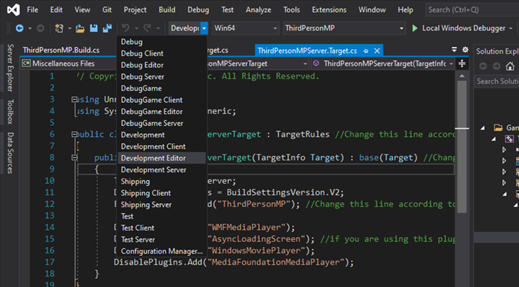

# Instructions on Integrating the Playfab GSDK Unreal Plugin Preview
This Unreal Plugin is implementing the GSDK directly in Unreal Engine.

It was tested with Unreal Engine 4.26.2, but should work with other engines as well. The sample game these instructions were created with was called ThirdPersonMP, so replace anywhere you see that with your game name.

# Prerequisites:
- Download Unreal Engine Source Build by following [these instructions](https://docs.unrealengine.com/4.26/en-US/ProgrammingAndScripting/ProgrammingWithCPP/DownloadingSourceCode/) from the Unreal website
- Download Unreal Engine (this was tested on 4.26.2)
- Download the [Unreal PlayfabGSDK Plugin folder](https://github.com/PlayFab/gsdk/tree/master/UnrealPlugin)
- Download Visual Studio (the [community version is free](https://visualstudio.microsoft.com/vs/community/))

# Setup

## Dependencies
When using the plugin a few things need to be taken care off.

First, open your File Explorer and create a folder called “Plugins” in your games' root directory. Then drag the Playfab GSDK plugin file into the Plugins folder.

Right click on the .uproject file and choose the option to "Switch Unreal Engine version", which is how you can quickly check which Unreal Engine version you are currently using. 
The popup seen below should appear. If you already see that the Unreal Engine version is source build, you don’t need to change anything, so click Cancel. If the Unreal version is not 
currently the source build, select it from the dropdown list and then click OK. 


Right click on the .uproject file again and select “Generate Visual Studio Project Files".

Then, double click to open the .uproject in Unreal.

Using the Unreal development environment, go to Files->Create a new C++ class and select the option to "Show all classes". Then search for GameInstance. By selecting it directly, everything should be generated correctly and then you can add the functions we detail below.

Then close Unreal and generate project files in source build mode again.

Then using Visual Studio, open those newly created files and add in the following methods for MyGameInstance.cpp and MyGameInstance.h.

#### MyGameInstance.cpp
```c_cpp 
// Fill out your copyright notice in the Description page of Project Settings.
#include "MyGameInstance.h"
#include "PlayfabGSDK.h"
#include "ThirdPersonMP.h"

void UMyGameInstance::Init()
{
	FPlayfabGSDKModule::Get().OnShutdown.BindUObject(this, &UMyGameInstance::OnGSDKShutdown);
	FPlayfabGSDKModule::Get().OnHealthCheck.BindUObject(this, &UMyGameInstance::OnGSDKHealthCheck);
}

void UMyGameInstance::OnStart()
{
	UE_LOG(LogTemp, Warning, TEXT("Reached onStart!"));
	if (!FPlayfabGSDKModule::Get().ReadyForPlayers())
	{
		FPlatformMisc::RequestExit(false);
	}
}

void UMyGameInstance::OnGSDKShutdown()
{
	UE_LOG(LogTemp, Warning, TEXT("Shutdown!"));
	FPlatformMisc::RequestExit(false);
}

bool UMyGameInstance::OnGSDKHealthCheck()
{
	UE_LOG(LogTemp, Warning, TEXT("Healthy!"));
	return true;
}
```

#### MyGameInstance.h:
```csharp
// Fill out your copyright notice in the Description page of Project Settings.

#pragma once

#include "CoreMinimal.h"
#include "Engine/GameInstance.h"
#include "MyGameInstance.generated.h"

/**
 *
 */
UCLASS()
class THIRDPERSONMP_API UMyGameInstance : public UGameInstance
{
	GENERATED_BODY()

public:

	virtual void Init() override;
	virtual void OnStart() override;

protected:

	void OnGSDKShutdown();
	bool OnGSDKHealthCheck();
};
```
In your MyGameInstance.h file make sure you replace the line that says class THIRDPERSONMP_API should say class [YOUR GAME NAME IN ALL CAPS_API]. 

## Disabling Plugins
When you add Dedicated Server support to your project, you will definitely have created a <projectname>Server.Target.cs file.

Update [game name]Server.target.cs and add the following lines to the constructor of this class:

DisablePlugins.Add("WMFMediaPlayer");
DisablePlugins.Add("AsyncLoadingScreen"); //if you are using this plugin
DisablePlugins.Add("WindowsMoviePlayer");
DisablePlugins.Add("MediaFoundationMediaPlayer");

Result should be:
```csharp 
public class <projectname>ServerTarget : TargetRules
{
	public <projectname>ServerTarget( TargetInfo Target) : base(Target)
	{
		Type = TargetType.Server;
		DefaultBuildSettings = BuildSettingsVersion.V2;
		ExtraModuleNames.AddRange( new string[] { "<projectname>" } );
		
		DisablePlugins.Add("WMFMediaPlayer");
		DisablePlugins.Add("AsyncLoadingScreen"); //if you are using this plugin
		DisablePlugins.Add("WindowsMoviePlayer");
		DisablePlugins.Add("MediaFoundationMediaPlayer");
	}
}
```

There are two ways to include the app-local prerequisites - either through the Unreal Engine editor or by editing DefaultGame.ini.
###### In the Unreal Editor
In the editor go to Edit -> Project Settings. In the opened window navigate to Packaging on the left side. Scroll to the bottom of the list, and tick "Include app-local prerequisities".

###### In DefaultGame.ini
Or you can update DefaultGame.ini to show the following:
 [/Script/UnrealEd.ProjectPackagingSettings]
IncludeAppLocalPrerequesites=True

If the category already exists in your DefaultGame.ini, then just add the second line to it. This ensures that all app local dependencies ship with the game as well.

If you are using Continuous Integration (CI), then you could add it to your setup to only turn this flag on when building a dedicated server, so the additional dlls only get added if it is a dedicated server build.

Update [game name].Build.cs file to add "PlayfabGSDK" into the PublicDependencyModuleNames.AddRange(); list as follows:

```csharp
		PublicDependencyModuleNames.AddRange(new string[] { "Core", "CoreUObject", "Engine", "InputCore", "HeadMountedDisplay", "PlayfabGSDK"});

		PrivateDependencyModuleNames.AddRange(new string[] { });
```

There are two ways to update the Game Instance Class - either through the Unreal Engine editor or by editing DefaultEngine.ini directly. 
###### In the Unreal Editor
In the editor, This can also be set through the UI in the editor. In the editor go to Edit -> Project Settings. From that opened window,
navigate to Maps&Modes on the left side. Scroll to the bottom, and then you can set the option "Game Instance Class" to your new game instance class directly, and avoid typos.

###### In DefaultEngine.ini
Or you can update DefaultEngine.ini file and add this:
[/Script/EngineSettings.GameMapsSettings]
GameInstanceClass=/Script/[game name].MyGameInstance

Then select the option to build from development editor mode and build the project.



Then select the option to build from development server mode and build the project again.

Once the build succeeds, close Visual Studio.

## Packaging the game server

Right click on the .uproject file in your file editor and select "Generate Visual Studio Project Files". 

Then open the .uproject file.

In the top left of the Unreal editor menu, click on file->package->target configuration ->[game name] server and then go to file -> package -> windows x64. 
You can now use this packaged version of your game server to [test with LocalMultiplayerAgent](https://docs.microsoft.com/en-us/gaming/playfab/features/multiplayer/servers/locally-debugging-game-servers-and-integration-with-playfab) 
or to use it directly with Playfab by [creating a build](https://developer.playfab.com/) and then using [Playfab MpsAllocatorSample](https://github.com/PlayFab/MpsSamples/blob/master/MpsAllocatorSample/README.md).