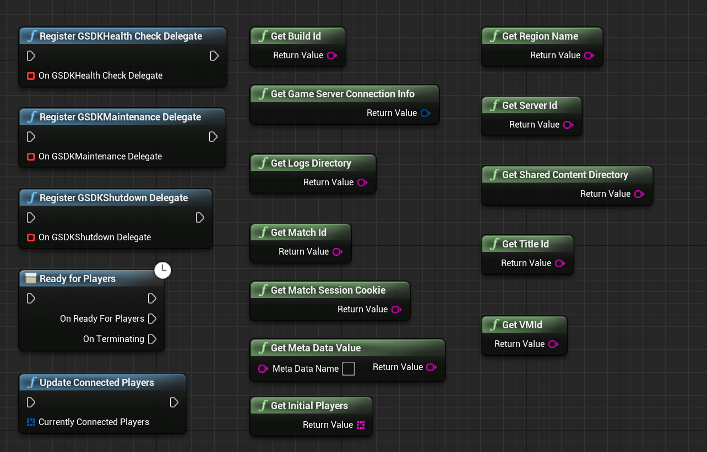

# Instructions on Integrating the Playfab GSDK Unreal Plugin Preview
This Unreal Plugin is implementing the GSDK directly in Unreal Engine.

This plugin offers both a Blueprint API and a C++ API. This does however not mean that the Blueprint API does not require the game to be a C++ project. If it is currently a Blueprint only project, then you need to convert it beforehand, before adding the plugin.

The following nodes are supported:


It was tested with Unreal Engine 4.26.2, but should work with other engines as well.

The sample game these instructions were created with was called ThirdPersonMP, so replace anywhere you see that with your game name.

# Prerequisites:
- Download Unreal Engine Source Build by following [these instructions](https://docs.unrealengine.com/4.26/en-US/ProgrammingAndScripting/ProgrammingWithCPP/DownloadingSourceCode/) from the Unreal Engine website (this was tested on 4.26.2)
- Download the [Unreal PlayfabGSDK Plugin folder](https://github.com/PlayFab/gsdk/tree/master/UnrealPlugin)
- Download Visual Studio (the [community version is free](https://visualstudio.microsoft.com/vs/community/))

# Setup

## Adding the plugin to the project
When using the plugin a few things need to be taken care off.

First, open File Explorer and create a folder called “Plugins” in your games' root directory and in the Plugins folder, create a folder called "PlayfabGSDK". Then, drag all the Playfab GSDK Unreal plugin files from here into the Plugins/PlayfabGSDK folder.

Open the .uproject file in a text editor of your choice. In the plugins array add the PlayfabGSDK.

See the example below:

```json
{
    "FileVersion": 3,
    "EngineAssociation": "4.26",
    "Category": "",
    "Description": "",
    "Modules": [
        {
            "Name": "<projectname>",
            "Type": "Runtime",
            "LoadingPhase": "Default",
            "AdditionalDependencies": [
                "Engine"
            ]
        }
    ],
    "Plugins": [                    // Add this if it doesn't exist
        {                           // Add this
            "Name": "PlayfabGSDK",  // Add this
            "Enabled": true         // Add this
        }                           // Add this
    ]                               // Add this if it doesn't exist
}
```

## Include the plugin in your modules
Update <modulename>.Build.cs file to add "PlayfabGSDK" into the PublicDependencyModuleNames.AddRange(); list as follows:

```csharp
PublicDependencyModuleNames.AddRange(new string[] { "Core", "CoreUObject", "Engine", "InputCore", "HeadMountedDisplay", "PlayfabGSDK"});

PrivateDependencyModuleNames.AddRange(new string[] { });
```

Right click on the .uproject file and choose the option to "Switch Unreal Engine version", which is how you can quickly check which Unreal Engine version you are currently using. 
The popup seen below should appear. If you already see that the Unreal Engine version is source build, you don’t need to change anything, so click Cancel. If the Unreal version is not 
currently the source build, select it from the dropdown list and then click OK. 


Right click on the .uproject file again and select “Generate Visual Studio Project Files".

Then, build the project in Visual Studio and start the Editor by selecting the Development Editor configuration.


## Disabling Plugins
When you add Dedicated Server support to your project, you will definitely have created a <projectname>Server.Target.cs file.

Update [game name]Server.target.cs and add the following lines to the constructor of this class:

```csharp 
DisablePlugins.Add("WMFMediaPlayer");
DisablePlugins.Add("AsyncLoadingScreen"); //if you are using this plugin
DisablePlugins.Add("WindowsMoviePlayer");
DisablePlugins.Add("MediaFoundationMediaPlayer");
```

Result should be:
```csharp 
public class <projectname>ServerTarget : TargetRules
{
    public <projectname>ServerTarget( TargetInfo Target) : base(Target)
    {
        Type = TargetType.Server;
        DefaultBuildSettings = BuildSettingsVersion.V2;
        ExtraModuleNames.AddRange( new string[] { "<projectname>" } );
        
        DisablePlugins.Add("WMFMediaPlayer");
        DisablePlugins.Add("AsyncLoadingScreen"); //if you are using this plugin
        DisablePlugins.Add("WindowsMoviePlayer");
        DisablePlugins.Add("MediaFoundationMediaPlayer");
    }
}
```

## Example integration

## C++ integration
In the Unreal Editor, go to Files->Create a new C++ class and select the option to "Show all classes". Then search for GameInstance. By selecting it directly, everything should be generated correctly and then you can add the functions we detail below.

Then close Unreal and generate project files in source build mode again.

Then using Visual Studio, open those newly created files and add in the following methods for MyGameInstance.cpp and MyGameInstance.h.

#### MyGameInstance.cpp
```cpp 
#include "MyGameInstance.h"

#include "GSDKUtils.h"

void UMyGameInstance::Init()
{
    FOnGSDKShutdown_Dyn OnGsdkShutdown;
    OnGsdkShutdown.BindDynamic(this, &UMyGameInstance::OnGSDKShutdown);
    FOnGSDKHealthCheck_Dyn OnGsdkHealthCheck;
    OnGsdkHealthCheck.BindDynamic(this, &UMyGameInstance::OnGSDKHealthCheck);

    UGSDKUtils::RegisterGSDKShutdownDelegate(OnGsdkShutdown);
    UGSDKUtils::RegisterGSDKHealthCheckDelegate(OnGsdkHealthCheck);
}

void UMyGameInstance::OnStart()
{
    UE_LOG(LogTemp, Warning, TEXT("Reached onStart!"));
    if (!UGSDKUtils::ReadyForPlayers())
    {
        FPlatformMisc::RequestExit(false);
    }
}

void UMyGameInstance::OnGSDKShutdown()
{
    UE_LOG(LogTemp, Warning, TEXT("Shutdown!"));
    FPlatformMisc::RequestExit(false);
}

bool UMyGameInstance::OnGSDKHealthCheck()
{
    UE_LOG(LogTemp, Warning, TEXT("Healthy!"));
    return true;
}
```

#### MyGameInstance.h:
```cpp
// Fill out your copyright notice in the Description page of Project Settings.

#pragma once

#include "CoreMinimal.h"
#include "Engine/GameInstance.h"
#include "MyGameInstance.generated.h"

/**
 *
 */
UCLASS()
class THIRDPERSONMP_API UMyGameInstance : public UGameInstance
{
    GENERATED_BODY()

public:

    virtual void Init() override;
    virtual void OnStart() override;

protected:

    UFUNCTION()
    void OnGSDKShutdown();
    
    UFUNCTION()
    bool OnGSDKHealthCheck();
};
```
In your MyGameInstance.h file make sure you replace the line that says class THIRDPERSONMP_API should say class [YOUR GAME NAME IN ALL CAPS_API].

### Blueprint implementation
In a folder of your choice in the Content Browser right-click and create a Blueprint class. In the All classes dropdown menu find the GameInstance class. In this example the blueprint is named "BP_GameInstance".

Double-click the blueprint and on the left side hover over the function field and click the Override dropdown. Select the Init function.

Right-click in the graph and add in all register GSDK function. 

For GSDK Shutdown and Maintenance Delegate drag out the a line from the red square, and select "Add Custom Event". 

For "Register GSDK Health Check Delegate" select the "Create Event" in the "Event Dispatchers".

In the dropdown of the new node "Create matching function". **This is important, as the GSDK Health Check Delegate has a return value.**


In the function make sure the return boolean value is checked.


Don't forget to connect all the nodes to the Event Init node.

In the end add the "Ready for Players" to be able to react to the ready signal of Playfab.


## Set the Game Instance class
    
After creating a custom game instance class that integrates with the gsdk, you have to configure your project to actually use this newly created game instance class. There are two ways to do this - either through the Unreal Engine editor or by editing DefaultEngine.ini directly. 
###### In the Unreal Editor
In the editor, This can also be set through the UI in the editor. In the editor go to Edit -> Project Settings. From that opened window,
navigate to Maps&Modes on the left side. Scroll to the bottom, and then you can set the option "Game Instance Class" to your new game instance class directly, and avoid typos.

###### In DefaultEngine.ini
Or you can update DefaultEngine.ini file and add this:
```ini
[/Script/EngineSettings.GameMapsSettings]
GameInstanceClass=/Script/[game name].MyGameInstance
```

## Include Pre-requisites for Windows Dedicated Server
There are two ways to include the app-local prerequisites - either through the Unreal Engine editor or by editing DefaultGame.ini.
### In the Unreal Editor
In the editor go to Edit -> Project Settings. In the opened window navigate to Packaging on the left side. Scroll to the bottom of the list, and tick "Include app-local prerequisities".

### In DefaultGame.ini
Or you can update DefaultGame.ini to show the following:
```ini
[/Script/UnrealEd.ProjectPackagingSettings]
IncludeAppLocalPrerequesites=True
```

If the category already exists in your DefaultGame.ini, then just add the second line to it. This ensures that all app local dependencies ship with the game as well.

If you are using Continuous Integration (CI), then you could add it to your setup to only turn this flag on when building a dedicated server, so the additional dlls only get added if it is a dedicated server build.

## Packaging the game server

Make sure that you have just built your project in development editor in Visual Studio *before* doing this next step, because sometimes building fails when opening the project directly through the .uproject file.

Right click on the .uproject file in your file editor and select "Generate Visual Studio Project Files". 

Then open the .uproject file.

In the top left of the Unreal editor menu, click on File -> Package -> Target Configuration -> [game name]Server and then go to File -> Package -> Windowsx64. 
You can now use this packaged version of your game server to [test with LocalMultiplayerAgent](https://docs.microsoft.com/en-us/gaming/playfab/features/multiplayer/servers/locally-debugging-game-servers-and-integration-with-playfab) 
or to use it directly with Playfab by [creating a build](https://developer.playfab.com/) and then using [Playfab MpsAllocatorSample](https://github.com/PlayFab/MpsSamples/blob/master/MpsAllocatorSample/README.md).

## Setting up a Windows Dedicated Server on Playfab
An important note about this is that you need to set the start command in process-based mode to \<root folder\>\\Binaries\\Win64\\\<project name\>Server.exe (or however the executable is called in the folder).

In container-based mode use \<mount folder\>\\\<root folder\>\\Binaries\\Win64\\\<project name\>Server.exe (or however the executable is called in the folder).

**If you use the executable in the root folder, the server will fail to initialize with the Playfab system.**

## Setting up a Linux Dedicated Server on Playfab
During testing the following Dockerfile worked excellent with the Playfab Linux VM:
```Dockerfile
FROM ubuntu:18.04

# Unreal refuses to run as root user, so we must create a user to run as
# Docker uses root by default
RUN useradd --system ue
USER ue

EXPOSE 7777/udp

WORKDIR /server

COPY --chown=ue:ue . /server
CMD ./<projectname>Server.sh
```
Thank you to [narthur157](https://github.com/narthur157) for this amazing [Dockerfile](https://github.com/narthur157/playfab-gsdk-ue4).
