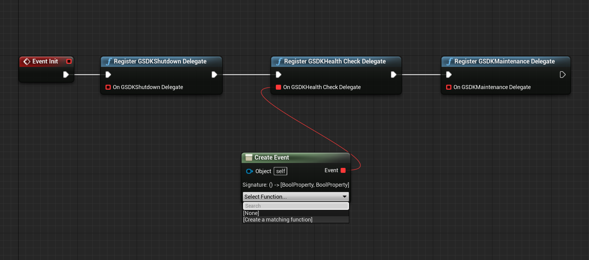

# Instructions on Integrating the PlayFab GSDK Unreal Plugin Preview

This Unreal Plugin is implementing the GSDK directly in Unreal Engine.

This plugin offers both a Blueprint API and a C++ API. This does however not mean that the Blueprint API does not require the game to be a C++ project. If it is currently a Blueprint only project, then you need to convert it beforehand, before adding the plugin.

The following nodes are supported:


It was tested with Unreal Engine 4.26.2, but should work with other engines as well.

The sample game these instructions were created with was called ThirdPersonMP, so replace anywhere you see that with your game name.

# Prerequisites:

- Download Unreal Engine Source Build by following [these instructions](https://docs.unrealengine.com/4.26/en-US/ProgrammingAndScripting/ProgrammingWithCPP/DownloadingSourceCode/) from the Unreal Engine website. This was tested on [4.26.2](https://github.com/EpicGames/UnrealEngine/releases/tag/4.26.2-release) (Link requires permissions)
- Download the [Unreal PlayFabGSDK Plugin folder](https://github.com/PlayFab/gsdk/tree/master/UnrealPlugin)
- [Optional] Download the [LocalMultiplayerAgent](https://github.com/PlayFab/MpsAgent/tree/main/LocalMultiplayerAgent)
- Download Visual Studio (the [community version is free](https://visualstudio.microsoft.com/vs/community/))
	- Requires Workloads: .NET desktop development, and Desktop development with C++

# Setup

## Adding the plugin to the project

When using the plugin a few things need to be taken care off.

First, open File Explorer and create a folder called “Plugins” in your games' root directory and in the Plugins folder, create a folder called "PlayFabGSDK". Then, drag all the files from the UnrealPlugin folder in this repo into the Plugins/PlayFabGSDK folder.

Open the .uproject file in a text editor of your choice. In the plugins array add the PlayFabGSDK.

See the example below:

```json
{
    "FileVersion": 3,
    "EngineAssociation": "4.26",
    "Category": "",
    "Description": "",
    "Modules": [
        {
            "Name": "<projectname>",
            "Type": "Runtime",
            "LoadingPhase": "Default",
            "AdditionalDependencies": [
                "Engine"
            ]
        }
    ],
    "Plugins": [                    // Add this if it doesn't exist
        {                           // Add this
            "Name": "PlayFabGSDK",  // Add this
            "Enabled": true         // Add this
        }                           // Add this
    ]                               // Add this if it doesn't exist
}
```

## Include the plugin in your modules

Update <modulename>.Build.cs file to add "PlayFabGSDK" into the PublicDependencyModuleNames.AddRange(); list as follows:

```csharp
PublicDependencyModuleNames.AddRange(new string[] { "Core", "CoreUObject", "Engine", "InputCore", "HeadMountedDisplay", "PlayFabGSDK"});

PrivateDependencyModuleNames.AddRange(new string[] { });
```

Right click on the .uproject file and choose the option to "Switch Unreal Engine version", which is how you can quickly check which Unreal Engine version you are currently using. 
The popup seen below should appear. If you already see that the Unreal Engine version is source build, you don’t need to change anything, so click Cancel. If the Unreal version is not 
currently the source build, select it from the dropdown list and then click OK. 


Right click on the .uproject file again and select “Generate Visual Studio Project Files".

Then, build the project in Visual Studio and start the Editor by selecting the Development Editor configuration.


## Project Setup

Unreal GSDK is installed into the server project. You will need a network-enabled multiplayer Unreal project with a dedicated-server mode. If you do not have one, you can follow our [Unreal prerequsitie setup](ThirdPersonMPSetup.md) guide. Once you have a network-enabled, multiplayer game, with a dedicated server, return here and continue.

Once your project has enabled server mode, you will have a <projectname>Server.Target.cs file.

Result should similar to:
```csharp 
public class <projectname>ServerTarget : TargetRules
{
    public <projectname>ServerTarget( TargetInfo Target) : base(Target)
    {
        Type = TargetType.Server;
        DefaultBuildSettings = BuildSettingsVersion.V2;
        ExtraModuleNames.AddRange( new string[] { "<projectname>" } );

	// You may have additional configuration based on your server needs
    }
}
```

For Windows builds, you may need to add these optional configuations:
```csharp
DisablePlugins.Add("WMFMediaPlayer");
DisablePlugins.Add("AsyncLoadingScreen"); //if you are using this plugin
DisablePlugins.Add("WindowsMoviePlayer");
DisablePlugins.Add("MediaFoundationMediaPlayer");
```
NOTE: These configurations are invalid for a Linux server build.

## Example C++ integration

## Updating the GameInstance Class

### Creating a GameInstance Class

If you are in the process of creating a game from scratch and do not yet have a GameInstance class, then first follow these example instructions to create a GameInstance class. 

If you are using a game that already has a GameInstance class, (for example, ShooterGame from Unreal's sample library), then move on to the section titled _**Modify the GameInstance Class**_.

----

In the Unreal Editor, go to Files->Create a new C++ class and select the option to "Show all classes". Then search for GameInstance. 
By selecting it directly, everything should be generated correctly and then you can add the functions we detail below.

Then close Unreal and generate project files in source build mode again.

Then using Visual Studio, open those newly created files and follow instructions to modify the Game Instance class.

### Modify the Game Instance Class

Locate your GameInstance class, which is most likely called something similar to [your game name]GameInstance or MyGameInstance. From now on, your game instance class will
be denoted with [YourGameInstanceClassName].

#### Modifying the GameInstance header file

First, check the include statements and ensure that the following are included in the header file for your GameInstance class ([YourGameInstanceClassName].h):

```cpp
#include "CoreMinimal.h"
#include "Engine/GameInstance.h"
#include "MyGameInstance.generated.h"
```

Then, add the following declarations to the public section:
(If you already have an Init() function, there is no need to include another declaration)

```cpp
public:

    virtual void Init() override;
    virtual void OnStart() override;
```

Then, add the following declarations to the protected section of methods:
```cpp
protected:

    UFUNCTION()
    void OnGSDKShutdown();
    
    UFUNCTION()
    bool OnGSDKHealthCheck();
};
```

#### Modifying the GameInstance Cpp file

Then, locate the [YourGameInstanceClassName].cpp file. 

Make sure that the following are included:

```cpp 
#include "[YourGameInstanceClassName].h"
#include "PlayfabGSDK.h"
#include "GSDKUtils.h"
```

Then locate your Init() function. If you _**don't**_ have an Init() function yet, then add in the function as such:

##### Creating Init() function

```cpp 
void U[YourGameInstanceClassName]::Init()
{
    FOnGSDKShutdown_Dyn OnGsdkShutdown;
    OnGsdkShutdown.BindDynamic(this, &UMyGameInstance::OnGSDKShutdown);
    FOnGSDKHealthCheck_Dyn OnGsdkHealthCheck;
    OnGsdkHealthCheck.BindDynamic(this, &UMyGameInstance::OnGSDKHealthCheck);

    UGSDKUtils::RegisterGSDKShutdownDelegate(OnGsdkShutdown);
    UGSDKUtils::RegisterGSDKHealthCheckDelegate(OnGsdkHealthCheck);
}
``` 
----
If you already **had** an Init() function,
go to check in [YourGameInstanceClassName].cpp file to see if you have a variable that indicates whether the instance is 
for a dedicated server. **If you can find this variable**, then add in this in at the end of your Init() function:

##### Modifying Existing Init() function

```cpp
	if (IsDedicatedServerInstance() == true)
	{
		FOnGSDKShutdown_Dyn OnGsdkShutdown;
		OnGsdkShutdown.BindDynamic(this, &UShooterGameInstance::OnGSDKShutdown);
		FOnGSDKHealthCheck_Dyn OnGsdkHealthCheck;
		OnGsdkHealthCheck.BindDynamic(this, &UShooterGameInstance::OnGSDKHealthCheck);

		UGSDKUtils::RegisterGSDKShutdownDelegate(OnGsdkShutdown);
		UGSDKUtils::RegisterGSDKHealthCheckDelegate(OnGsdkHealthCheck);

		OnStart();
	}
```
**If you can't find a variable like IsDedicatedServerInstance(),** we still want to make sure that ReadyForPlayers() and onStart() are used when using 
a dedicated server, so you could wrap the call to ReadyForPlayers() as such at the bottom of the Init function:

```cpp
#if UE_SERVER
    if (!UGSDKUtils::ReadyForPlayers())
    {
        FPlatformMisc::RequestExit(false);
    }
#endif
```
----

Lastly, add these method implementations to the bottom of [YourGameInstanceClassName].cpp file:

```cpp
void UMyGameInstance::OnStart()
{
    UE_LOG(LogTemp, Warning, TEXT("Reached onStart!"));
    if (!UGSDKUtils::ReadyForPlayers())
    {
        FPlatformMisc::RequestExit(false);
    }
}

void UMyGameInstance::OnGSDKShutdown()
{
    UE_LOG(LogTemp, Warning, TEXT("Shutdown!"));
    FPlatformMisc::RequestExit(false);
}

bool UMyGameInstance::OnGSDKHealthCheck()
{
    UE_LOG(LogTemp, Warning, TEXT("Healthy!"));
    return true;
}
```

## Blueprint implementation

In a folder of your choice in the Content Browser right-click and create a Blueprint class. In the All classes dropdown menu find the GameInstance class. In this example the blueprint is named "BP_GameInstance".

Double-click the blueprint and on the left side hover over the function field and click the Override dropdown. Select the Init function.

Right-click in the graph and add in all register GSDK function. 

For GSDK Shutdown and Maintenance Delegate drag out the a line from the red square, and select "Add Custom Event". 

For "Register GSDK Health Check Delegate" select the "Create Event" in the "Event Dispatchers".

In the dropdown of the new node "Create matching function". **This is important, as the GSDK Health Check Delegate has a return value.**


In the function make sure the return boolean value is checked.


Don't forget to connect all the nodes to the Event Init node.

In the end add the "Ready for Players" to be able to react to the ready signal of PlayFab.


## Set the Game Instance class
    
After creating a custom game instance class that integrates with the gsdk, you have to configure your project to actually use this newly created game instance class. There are two ways to do this - either through the Unreal Engine editor or by editing DefaultEngine.ini directly.

###### In the Unreal Editor

In the editor, this can also be set through the UI in the editor. In the editor go to Edit -> Project Settings. From that opened window,
navigate to Maps&Modes on the left side. Scroll to the bottom, and then you can set the option "Game Instance Class" to your new game instance class directly, and avoid typos.

###### In DefaultEngine.ini

Or you can update DefaultEngine.ini file and add this:
```ini
[/Script/EngineSettings.GameMapsSettings]
GameInstanceClass=/Script/[game name].MyGameInstance
```

## Include Pre-requisites for Windows Dedicated Server

There are two ways to include the app-local prerequisites - either through the Unreal Engine editor or by editing DefaultGame.ini.

### In the Unreal Editor

In the editor go to Edit -> Project Settings. In the opened window navigate to Packaging on the left side. Scroll to the bottom of the list, and tick "Include app-local prerequisites".

### In DefaultGame.ini

Or you can update DefaultGame.ini to show the following:
```ini
[/Script/UnrealEd.ProjectPackagingSettings]
IncludeAppLocalPrerequisites=True
```

If the category already exists in your DefaultGame.ini, then just add the second line to it. This ensures that all app local dependencies ship with the game as well.

If you are using Continuous Integration (CI), then you could add it to your setup to only turn this flag on when building a dedicated server, so the additional dlls only get added if it is a dedicated server build.

## Packaging the game server

Make sure that you have just built your project in development editor in Visual Studio *before* doing this next step, because sometimes building fails when opening the project directly through the .uproject file.

Right click on the .uproject file in your file editor and select "Generate Visual Studio Project Files". 

Then open the .uproject file.

In the top left of the Unreal editor menu, click on File -> Package -> Target Configuration -> [game name]Server and then go to File -> Package -> Windowsx64. 
You can now use this packaged version of your game server to [test with LocalMultiplayerAgent](https://docs.microsoft.com/en-us/gaming/playfab/features/multiplayer/servers/locally-debugging-game-servers-and-integration-with-playfab) 
or to use it directly with PlayFab by [creating a build](https://developer.playfab.com/) and then using [PlayFab MpsAllocatorSample](https://github.com/PlayFab/MpsSamples/blob/master/MpsAllocatorSample/README.md).

## Setting up a Windows Dedicated Server on PlayFab

An important note about this is that you need to set the start command in process-based mode to \<root folder\>\\Binaries\\Win64\\\<project name\>Server.exe (or however the executable is called in the folder).

In container-based mode use \<mount folder\>\\\<root folder\>\\Binaries\\Win64\\\<project name\>Server.exe (or however the executable is called in the folder).

**If you use the executable in the root folder, the server will fail to initialize with the PlayFab system.**

## Setting up a Linux Dedicated Server on PlayFab

During testing the following Dockerfile + startup.sh script worked excellent with the PlayFab Linux VM:

### The Dockerfile:

```Dockerfile
FROM ubuntu:18.04

# Unreal refuses to run as root user, so we must create a user to run as
# Docker uses root by default
RUN useradd --system ue
USER ue

EXPOSE 7777/udp

WORKDIR /server

COPY --chown=ue:ue . /server
USER root
CMD ./startup.sh
```

### startup&#46;sh bash script:

```bash
chown -R ue.ue $PF_SERVER_LOG_DIRECTORY
su ue -c ./<projectname>Server.sh
```
Make sure that the line endings in the startup&#46;sh file are LF (\\n) and not CRLF (\\r\\n).

Thank you to [narthur157](https://github.com/narthur157) for his amazing [Dockerfile](https://github.com/narthur157/playfab-gsdk-ue4), which this Dockerfile is based on.
