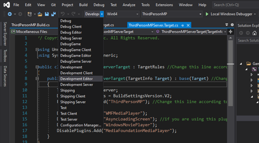
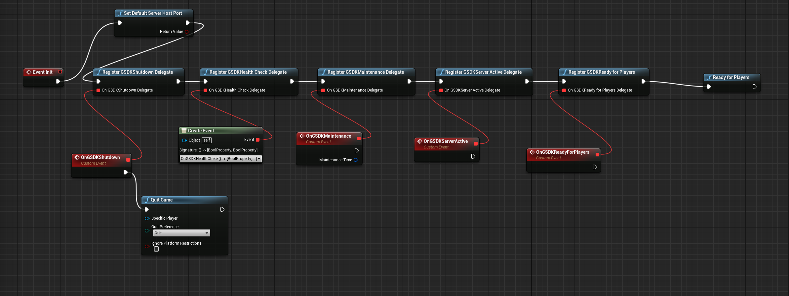

# ThirdPersonMP Example - GSDK Project Setup

This guide covers upgrading the finished Unreal ThirdPersonMP template and tutorial project, by adding and configuring the PlayFab GSDK. By following this guide, you will upgrade your existing project so it can be hosted on PlayFab Multiplayer Services.

Please note, your Unreal project must have the following capabilities:

* Networking
* Multiplayer
* Dedicated Game-Server

If not, you will need to return to the [ThirdPersonMP Example Project Setup](ThirdPersonMPSetup.md) guide to configure your project as a network-enabled multiplayer game, with dedicated server capabilities.

## Goals

We will add and configure the Playfab Unreal GSDK to your project, and test it locally to verify it is expected to work on PlayFab Multiplayer Services.

## Requirements

* Download Visual Studio. The [community version](https://visualstudio.microsoft.com/vs/community/) is free.
	* Required workloads: .NET desktop development and Desktop development with C++
* Download Unreal Engine Source Code. For instructions, see [Downloading Unreal Engine Source code (external)](https://docs.unrealengine.com/4.26/ProgrammingAndScripting/ProgrammingWithCPP/DownloadingSourceCode/).
* A completed [ThirdPersonMP Example Project](ThirdPersonMPSetup.md), or a project with similar capabilities
* [PlayFab Unreal GSDK plugin](https://github.com/PlayFab/gsdk/tree/main/UnrealPlugin)
* [Optional] [PlayFab Marketplace plugin](https://www.unrealengine.com/marketplace/product/playfab-sdk) or the [source version on GitHub](https://github.com/PlayFab/UnrealMarketplacePlugin/tree/master/4.26/PlayFabPlugin/PlayFab). This plugin is not required for GSDK but is required for many PlayFab services, including login.

## Adding the plugin to the project

Follow these steps to add the Unreal GSDK to your project:

* Go to your Unreal game project
* Open File Explorer and create a **Plugins** folder in your games' root directory. In the Plugins folder, create a folder called **PlayFabGSDK.**
* Go to **{depot}\\GSDK\\gsdk\\UnrealPlugin**. Drag all the files from the **UnrealPlugin** folder into the **Plugins/PlayFabGSDK** folder.
* Lastly, open your game project's **.uproject** file in a text editor of your choice. In the plugins array, add the "PlayFabGSDK" plugin.

See the example below:

```json
{
    "FileVersion": 3,
    "EngineAssociation": "<your engine version>",
    "Category": "",
    "Description": "",
    "Modules": [
        {
            "Name": "<projectname>",
            "Type": "Runtime",
            "LoadingPhase": "Default",
            "AdditionalDependencies": [
                "Engine"
            ]
        }
    ],
    "Plugins": [                    // Add this if it doesn't exist
        {                           // Add this
            "Name": "PlayFabGSDK",  // Add this
            "Enabled": true         // Add this
        }                           // Add this
    ]                               // Add this if it doesn't exist
}
```

### Include the plugin in your modules

Update <modulename>.Build.cs file to add "PlayFabGSDK" into the PublicDependencyModuleNames.AddRange(); list as follows:

```csharp
PublicDependencyModuleNames.AddRange(new string[] { "Core", "CoreUObject", "Engine", "InputCore", "HeadMountedDisplay", "PlayFabGSDK" });
```

* Right-click on the .uproject file and select the option to __Switch Unreal Engine version__, which is how you can quickly check which Unreal Engine version you are currently using. The popup seen below should appear. If you already see that the Unreal Engine version is source build, you don’t need to change anything, so click Cancel. If the Unreal version is not currently the source build, select it from the dropdown list and then click OK.


* Right-click on the .uproject file again and select "Generate Visual Studio Project Files". This is a very important step, if Unreal produces any errors then make sure that your UnrealBuildTool works correctly.

* Finally, build the project in Visual Studio and start the Editor by selecting the Development Editor configuration.



Once your project has enabled server mode, you will have a <projectname>Server.Target.cs file.

Result should look similar to:

```csharp
public class <projectname>ServerTarget : TargetRules
{
    public <projectname>ServerTarget( TargetInfo Target) : base(Target)
    {
        Type = TargetType.Server;
        DefaultBuildSettings = BuildSettingsVersion.V2;
        ExtraModuleNames.AddRange( new string[] { "<projectname>" } );

	// You may have additional configuration based on your server needs
    }
}
```

For Windows builds, you may need to add these optional configurations:

```csharp
DisablePlugins.Add("WMFMediaPlayer");
DisablePlugins.Add("AsyncLoadingScreen"); //if you are using this plugin
DisablePlugins.Add("WindowsMoviePlayer");
DisablePlugins.Add("MediaFoundationMediaPlayer");
```
NOTE: These configurations are invalid for a Linux server build.

## Project Setup

Depending on the setup of your game / project, you can choose to integrate GSDK in your game using the C++ or the Blueprint implementation that are both described below. First, you need to make sure that a GameInstance class exists, if not, follow the next steps.

### Creating/Updating the GameInstance Class

#### Creating a GameInstance Class

If you are in the process of creating a game from scratch and do not yet have a GameInstance class, then first follow these example instructions to create a GameInstance class. If you are using a game that already has a GameInstance class, (for example, ShooterGame from Unreal's sample library), then move on to the section titled _**Modify the GameInstance Class**_.

----

In the Unreal Editor, go to Files->Create a new C++ class and select the option to "Show all classes". Then search for GameInstance. By selecting it directly, everything should be generated correctly and then you can add the functions we detail below.

Then close Unreal and generate project files in source build mode again.

Then using Visual Studio, open those newly created files and follow instructions to modify the Game Instance class.

## C++ Implementation

#### Modify the Game Instance Class

Locate your GameInstance class, which is most likely called something similar to [your game name]GameInstance or MyGameInstance. From now on, your game instance class will be denoted with [YourGameInstanceClassName].

##### Modifying the GameInstance header file

First, check the include statements and ensure that the following are included in the header file for your GameInstance class ([YourGameInstanceClassName].h):

```cpp
#include "CoreMinimal.h"
#include "Engine/GameInstance.h"
#include "[YourGameInstanceClassName].generated.h"
```

[Optional]
With the following code, the user can introduce a log channel specifically for the GameInstance. Alternatively, logging with LogTemp is sufficient.

```cpp
DECLARE_LOG_CATEGORY_EXTERN(LogPlayFabGSDKGameInstance, Log, All);
```

Then, add the following declarations to the public section: (If you already have an Init() function, there is no need to include another declaration)

```cpp
public:

    virtual void Init() override;
    virtual void OnStart() override;
```

Then, add the following declarations to the protected section of methods:

```cpp
protected:

    UFUNCTION()
    void OnGSDKShutdown();

    UFUNCTION()
    bool OnGSDKHealthCheck();

    UFUNCTION()
    void OnGSDKServerActive();

    UFUNCTION()
    void OnGSDKReadyForPlayers();
```

##### Modifying the GameInstance Cpp file

Then, locate the [YourGameInstanceClassName].cpp file.

Make sure that the following are included:

```cpp
#include "[YourGameInstanceClassName].h"
#include "PlayfabGSDK.h"
#include "GSDKUtils.h"
```

If the custom log channel has been introduced in the header file, then the following code is necessary:
```cpp
DEFINE_LOG_CATEGORY(LogPlayFabGSDKGameInstance);
```

Then locate your Init() function. If you _**don't**_ have an Init() function yet, then add in the function as such:

###### Creating Init() function

```cpp
void U[YourGameInstanceClassName]::Init()
{
    FOnGSDKShutdown_Dyn OnGsdkShutdown;
    OnGsdkShutdown.BindDynamic(this, &U[YourGameInstanceClassName]::OnGSDKShutdown);
    FOnGSDKHealthCheck_Dyn OnGsdkHealthCheck;
    OnGsdkHealthCheck.BindDynamic(this, &U[YourGameInstanceClassName]::OnGSDKHealthCheck);
    FOnGSDKServerActive_Dyn OnGSDKServerActive;
    OnGSDKServerActive.BindDynamic(this, &U[YourGameInstanceClassName]::OnGSDKServerActive);
    FOnGSDKReadyForPlayers_Dyn OnGSDKReadyForPlayers;
    OnGSDKReadyForPlayers.BindDynamic(this, &U[YourGameInstanceClassName]::OnGSDKReadyForPlayers);

    UGSDKUtils::RegisterGSDKShutdownDelegate(OnGsdkShutdown);
    UGSDKUtils::RegisterGSDKHealthCheckDelegate(OnGsdkHealthCheck);
    UGSDKUtils::RegisterGSDKServerActiveDelegate(OnGSDKServerActive);
    UGSDKUtils::RegisterGSDKReadyForPlayers(OnGSDKReadyForPlayers);
}
```

----

If you already **had** an Init() function, go to check in [YourGameInstanceClassName].cpp file to see if you have a variable that indicates whether the instance is for a dedicated server. **If you can find this variable**, then add in this in at the end of your Init() function:

###### Modifying Existing Init() function

```cpp
    if (IsDedicatedServerInstance() == true)
    {
        FOnGSDKShutdown_Dyn OnGsdkShutdown;
        OnGsdkShutdown.BindDynamic(this, &UShooterGameInstance::OnGSDKShutdown);
        FOnGSDKHealthCheck_Dyn OnGsdkHealthCheck;
        OnGsdkHealthCheck.BindDynamic(this, &UShooterGameInstance::OnGSDKHealthCheck);
        FOnGSDKServerActive_Dyn OnGSDKServerActive;
        OnGSDKServerActive.BindDynamic(this, &UShooterGameInstance::OnGSDKServerActive);
        FOnGSDKReadyForPlayers_Dyn OnGSDKReadyForPlayers;
        OnGSDKReadyForPlayers.BindDynamic(this, &UShooterGameInstance::OnGSDKReadyForPlayers);

        UGSDKUtils::RegisterGSDKShutdownDelegate(OnGsdkShutdown);
        UGSDKUtils::RegisterGSDKHealthCheckDelegate(OnGsdkHealthCheck);
        UGSDKUtils::RegisterGSDKServerActiveDelegate(OnGSDKServerActive);
        UGSDKUtils::RegisterGSDKReadyForPlayers(OnGSDKReadyForPlayers);
    }
```

**Complete your Init function** by adding the following code that sets up the default port for MPS.

```cpp
#if UE_SERVER
    UGSDKUtils::SetDefaultServerHostPort();
#endif
```

----

Lastly, add these method implementations to the bottom of [YourGameInstanceClassName].cpp file:

```cpp
void U[YourGameInstanceClassName]::OnStart()
{
    UE_LOG(LogPlayFabGSDKGameInstance, Warning, TEXT("Reached onStart!"));
    UGSDKUtils::ReadyForPlayers();
}

void U[YourGameInstanceClassName]::OnGSDKShutdown()
{
    UE_LOG(LogPlayFabGSDKGameInstance, Warning, TEXT("Shutdown!"));
    FPlatformMisc::RequestExit(false);
}

bool U[YourGameInstanceClassName]::OnGSDKHealthCheck()
{
    UE_LOG(LogPlayFabGSDKGameInstance, Warning, TEXT("Healthy!"));
    return true;
}

void U[YourGameInstanceClassName]::OnGSDKServerActive()
{
    /**
     * Server is transitioning to an active state.
     * Optional: Add in the implementation any code that is needed for the game server when
     * this transition occurs.
     */
    UE_LOG(LogPlayFabGSDKGameInstance, Warning, TEXT("Active!"));
}

void U[YourGameInstanceClassName]::OnGSDKReadyForPlayers()
{
    /**
     * Server is transitioning to a StandBy state. Game initialization is complete and the game is ready
     * to accept players.
     * Optional: Add in the implementation any code that is needed for the game server before
     * initialization completes.
     */
    UE_LOG(LogPlayFabGSDKGameInstance, Warning, TEXT("Finished Initialization - Moving to StandBy!"));
}
```

## Blueprint implementation

This part is only needed if you have decided to not proceed with the pure C++ implementation for the GameInstance class that is described above and prefer the Blueprint implementation. Both of them have been equally tested.

* Observe the Content Browser window in the Unreal Editor
* Pick or create a folder to contain new Blueprints
* Right-Click and create a Blueprint class
* In the All classes dropdown menu find your GameInstance class
	* In this example the blueprint is named "<ProjectName>GameInstance"
* Double-click the blueprint
* On the left side hover over the function field and select the Override dropdown
* Select the Init function
* Right-click in the graph and add in all register GSDK function
* For GSDK Shutdown and Maintenance Delegate drag out the a line from the red square, and select "Add Custom Event"
* For "Register GSDK Health Check Delegate" select the "Create Event" in the "Event Dispatchers".
* 
* In the dropdown of the new node "Create matching function". **This is important, as the GSDK Health Check Delegate has a return value.**
* 
* In the function make sure the return boolean value is checked.
* 
* Don't forget to connect all the nodes to the Event Init node.
* In the end add the "ReadyforPlayers" to be able to react to the ready signal of PlayFab.
* Also, dont forget to add the "SetDefaultServerHostPort" node to connect to the port that GSDK expects.
* In general, if you are creating the Blueprint off the base GameInstance class of your game that you created above, or that your game already has, then all these functions will be displayed once you start typing them in every node, under PlayFab/GSDK.
* 

## Set the Game Instance class

After creating a custom game instance class (either through the pure C++ implementation or the Blueprint implementation) that integrates with the gsdk, you have to configure your project to actually use this newly created game instance class. There are two ways to do this - either through the Unreal Engine editor or by editing DefaultEngine.ini directly.

### In the Unreal Editor

In the editor, this can also be set through the UI.
* Go to Edit -> Project Settings.
* From that opened window, navigate to Maps&Modes on the left side.
* Scroll to the bottom, and then you can set the option "Game Instance Class" to your new game instance class directly, and avoid typos.
* If you are using the Blueprint implementation, make sure that the name matches the one used for your Blueprint.

### In DefaultEngine.ini

Or you can update DefaultEngine.ini file and add this:

```ini
[/Script/EngineSettings.GameMapsSettings]
GameInstanceClass=/Script/[game name].MyGameInstance
```

## Include Pre-requisites for Windows Dedicated Server

There are two ways to include the app-local prerequisites - either through the Unreal Engine editor or by editing DefaultGame.ini.

### In the Unreal Editor

In the editor go to Edit -> Project Settings. In the opened window navigate to Packaging on the left side. Scroll to the bottom of the list, and tick "Include app-local prerequisites".

### In DefaultGame.ini

Or you can update DefaultGame.ini to show the following:

```ini
[/Script/UnrealEd.ProjectPackagingSettings]
IncludeAppLocalPrerequisites=True
```

If the category already exists in your DefaultGame.ini, then just add the second line to it. This ensures that all app local dependencies ship with the game as well.

If you are using Continuous Integration (CI), then you could add it to your setup to only turn this flag on when building a dedicated server, so the additional dlls only get added if it is a dedicated server build.

## Navigation

You are now ready to [build your project](ThirdPersonMPBuild.md) on your local machine.

Alternately, you can return to the main [Unreal GSDK Plugin](README.md#unreal_project_build_configurations) guide.
